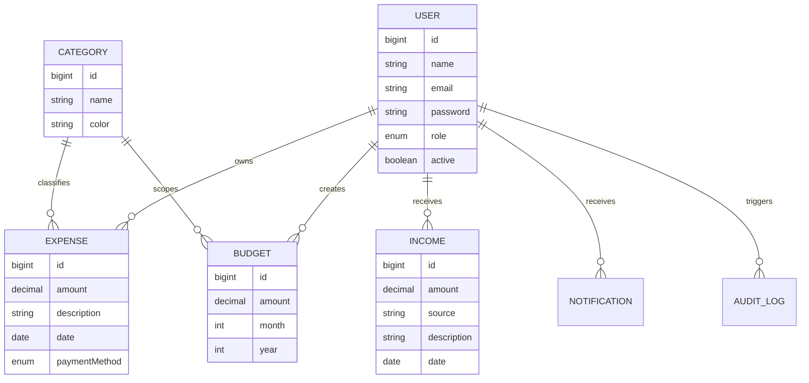

# Entity Relationship Diagram

```mermaid
erDiagram
 USER ||--o{ EXPENSE : owns
 USER ||--o{ INCOME : receives
 USER ||--o{ BUDGET : creates
 USER ||--o{ NOTIFICATION : receives
 USER ||--o{ AUDIT_LOG : triggers
 CATEGORY ||--o{ EXPENSE : classifies
 CATEGORY ||--o{ BUDGET : scopes
 USER { bigint id string name string email string password enum role boolean active }
 CATEGORY { bigint id string name string color }
 EXPENSE { bigint id decimal amount string description date date enum paymentMethod }
 INCOME { bigint id decimal amount string source string description date date }
 BUDGET { bigint id decimal amount int month int year }
```
