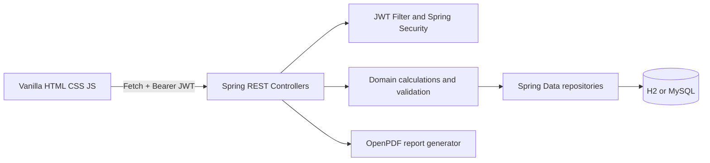

# System Architecture

The servlet filter validates the signed token, controllers enforce role boundaries, repositories scope records by the authenticated user, and response maps avoid exposing entity passwords. The current code keeps the domain classes compact for viva readability; business calculations are contained in controller services/helpers rather than frontend code.
